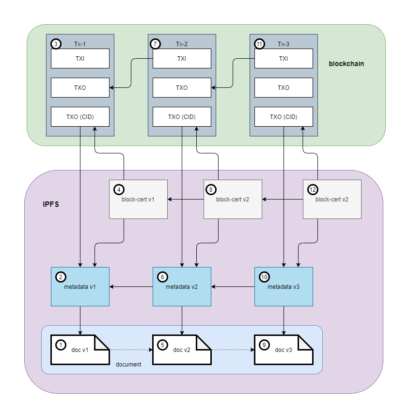

# metatron

Secure version control for metadata

## rules of ownership 

### precedence

- blockchain agnostic, precedence by block time
- testnet claims are provisional and may be overridden by any mainnet
- every metatron node may decide which blockchains to scan
    - this means that a node that scans only bitcoin may not recognize the ownership claims submitted to RavenCoin for example
    - let the market decide which blockchains should be used for this purpose
### BTC-derived blockchains
- ownership claims are submitted in special txns called auth txns (short for authorization transactions)
- the auth txn must contain one unspendable nulldata txo encoding the CID as a v1 multihash with a "CID1" prefix (80 hex digits encoding 40 bytes)
- the CID must resolve on IPFS to data transformable to a JSON object, the metadata document or metadoc for short
- the metadoc must have a top level property named `id` with a value of type `urn:xid:uuid` or xid for short
- the auth txn must contain one spendable txo with a value of "0.00001234" that establishes ownership of the metadoc
    - values below 6450(?) sats are prohibited by the bitcoin consensus as "dust"
    - since we need a positive value we might as well use it to distinguish auth txos
        - the relatively low value was selected deliberately to minimize value locked up in ownership claims
        - and also to make it unlikely that these txos will randomly be selected to cover fees
    - in order to update the metadoc for a given xid, a subsequent auth txn MUST spend the previous auth txo (this is the essential key to the whole system)
        - anyone can copy and publish a new version of the metadoc, it is public information
        - only the owner can publish an authorized revision
    - the txn will necessarily contain additional inputs and outputs to cover blockchain fees
    - it is the responsibility of the authorization software to ensure that auth txos are used only to update ownership claims, not for fees

### Operation

1. The first version of a document (or [image](diagrams/verified-versions-v1.png)) is created and added to IPFS. 
2. A [metadata document](meta-v0.json) references the CID of the doc v1. A random `idx` is generated for this object. It is the only property that must remain constant for the life of the object.
3. The first version is authorized by submitting an auth txn to a blockchain. The txn references the CID of the metadoc.
4. A blockchain scanner discovers the auth txn when it is confirmed on a block. The metadoc will be resolved from its CID on IPFS. The scanner will search its db for the idx in the metadoc but it won't be found since it is new. The scanner can confirm that the transaction inputs referenced in the auth txn are not auth txns. The first version of the block certification [block-cert](block-cert-v0.json) is created and added to IPFS. The idx is mapped to the CID of the block-cert in the db.
5. The author creates a new revision of the [image](diagrams/verified-versions-v2.png), doc v2.
6. The system updates the [metadoc](meta-v1.json) referencing the CID of the v2 of the doc and the CID of v1 of the metadoc. 
7. The second version is authorized by submitting an auth txn to the blockchain that references the CID of v2 of the metadoc and spends the the UTXO from the first auth txn.
8. The blockchain scanner discovers the v2 auth txn when it is confirmed on a block. Again it finds the idx by resolving the metadoc from IPFS. This time it finds the idx in the db mapped to the first block-cert. The scanner can confirm that the new auth txn spends the auth txn referenced in the block-cert. If everything checks out a new [block-cert](block-cert-v1.json) is created and added to IPFS. The db is updated so that idx is now mapped to the new block-cert.
9. The process is repeated for a 3rd version of the [image](diagrams/verified-versions-v3.png)
10. A new [metadoc](meta-v2.json) is created and added to IPFS.
11. An auth txn is submitted that references the new metadoc and spends the txo from the last auth txn.
12. The scanner discovers the new auth txn on the blockchain, verifies all the references are valid, creates a new [block-cert](block-cert-v3.json), adds it to IPFS, and updates the db so that the idx is mapped to the latest version.

