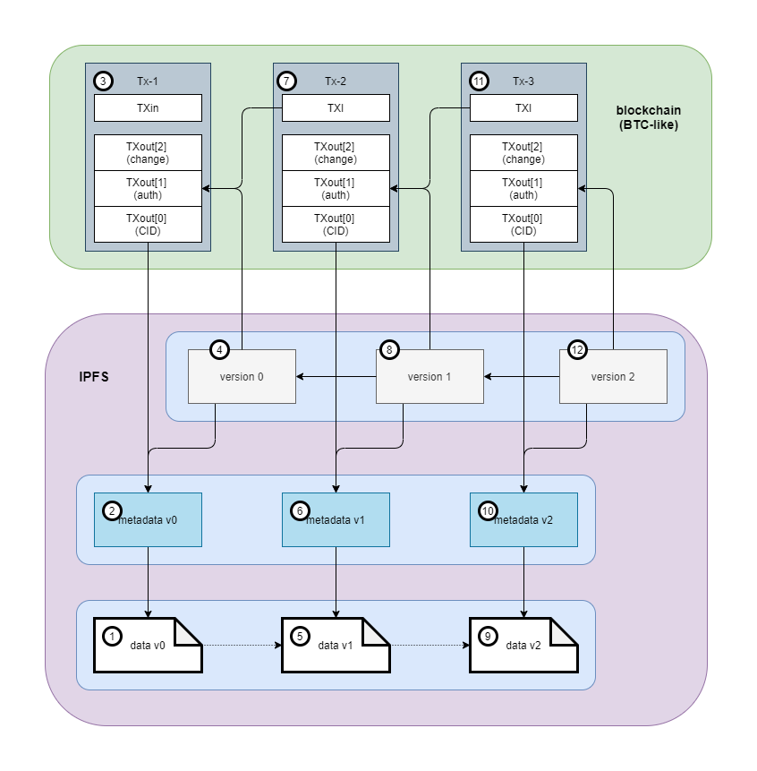
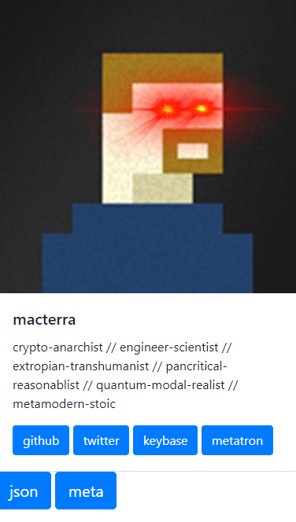
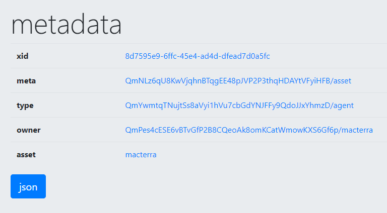
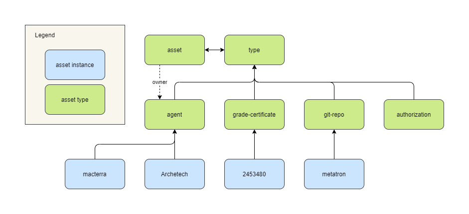

# Metatron

## The Extensible Identifier (xid)

The system provides a way to establish ownership of 128-bit random numbers called `xid` (for eXtensible IDentifier)

The value of the xid must be a random [UUID](https://en.wikipedia.org/wiki/Universally_unique_identifier)
- any UUID that can be compressed by zlib to less than its original length of 16 bytes will be considered invalid
- the xid should be a pure indexical, it should be able to point to any digital content without bias, including nothing in the case it is retired or disabled
- therefore the xid should contain no internal information (though it is always possible to encode encrypted information via the UUID5 standard)

The xid is associated with digital content by mapping it to a content identifier (CID) on IPFS
- if the CID resolves to a directory, it must have a top-level file named `meta.json` that includes a top-level property named `xid`
- if the CID resolves to a IPLD node, it should have a top-level object named `meta` that includes a top-level property named `xid` (TBD)
- if the CID resolves to a file, it is ignored

## Rules of ownership 

### Precedence

- blockchain agnostic, precedence by block time
- testnet claims are provisional and may be overridden by any mainnet
- every metatron node may decide which blockchains to scan
    - this means that a node that scans only bitcoin may not recognize the ownership claims submitted to RavenCoin for example
    - let the market decide which blockchains should be used for this purpose

### Bitcoin-derived blockchains

- ownership claims are submitted in special txns called auth txns (short for authorization transactions)
- the auth txn must contain one unspendable nulldata txo encoding IPFS CID (v0 or v1 multihash) at `vout` index 0
- the auth txn must contain one spendable txo at `vout` index 1 that establishes the chain of ownership of the xid
    - sufficiently low valued transactions are prohibited by the bitcoin consensus as "dust" because it costs more in transaction fees to spend them than they are worth
    - the value staked in the auth txn must be greater than the current dust value
    - in order to update the metadoc for a given xid, a subsequent auth txn MUST spend the previous auth txo (this is the essential key to the whole system)
        - anyone can copy and publish a new version of the metadoc since it is public information
        - **only the owner** can publish an `authorized version`
    - the txn will necessarily contain additional inputs and outputs to cover blockchain fees
    - it is the responsibility of the authorization software to ensure that auth txos are used only to update ownership claims, not for fees

### Operation

The system scans new blocks for auth transactions, validates them, generates version certificates for valid ones, and updates the version database. The version database simply maps each extent xid to the cid of the latest version certificate. Instances of the system that implement that same consensus rules and scan the same set of blockchains will necessarily converge on the same version database state analogously to the unspent transaction output (UTXO) set for a particular blockchain.

Nodes can sync with each other by authorizing their version database on the blockchain where other nodes can pick them up in their regular scans and compare them to their local versions to detect and correct any inconsistencies. This mechanism also provides a way for new nodes to synchronize quickly without scanning each entire blockchain from the beginning or a specific date. Validating the most recent version requires validating each previous version.



1. The first version of a document (or [image](diagrams/verified-versions-v1.png)) is created and added to IPFS. 
2. A [metadata document](meta-v0.json) references the CID of the doc v1. A random `idx` is generated for this object. It is the only property that must remain constant for the life of the object.
3. The first version is authorized by submitting an auth txn to a blockchain. The txn references the CID of the metadoc.
4. A blockchain scanner discovers the auth txn when it is confirmed on a block. The metadoc will be resolved from its CID on IPFS. The scanner will search its db for the idx in the metadoc but it won't be found since it is new. The scanner can confirm that the transaction inputs referenced in the auth txn are not auth txns. The first version of the block certification [block-cert](block-cert-v0.json) is created and added to IPFS. The idx is mapped to the CID of the block-cert in the db.
5. The author creates a new revision of the [image](diagrams/verified-versions-v2.png), doc v2.
6. The system updates the [metadoc](meta-v1.json) referencing the CID of the v2 of the doc and the CID of v1 of the metadoc. 
7. The second version is authorized by submitting an auth txn to the blockchain that references the CID of v2 of the metadoc and spends the the UTXO from the first auth txn.
8. The blockchain scanner discovers the v2 auth txn when it is confirmed on a block. Again it finds the idx by resolving the metadoc from IPFS. This time it finds the idx in the db mapped to the first block-cert. The scanner can confirm that the new auth txn spends the auth txn referenced in the block-cert. If everything checks out a new [block-cert](block-cert-v1.json) is created and added to IPFS. The db is updated so that idx is now mapped to the new block-cert.
9. The process is repeated for a 3rd version of the [image](diagrams/verified-versions-v3.png)
10. A new [metadoc](meta-v2.json) is created and added to IPFS.
11. An auth txn is submitted that references the new metadoc and spends the txo from the last auth txn.
12. The scanner discovers the new auth txn on the blockchain, verifies all the references are valid, creates a new [block-cert](block-cert-v3.json), adds it to IPFS, and updates the db so that the idx is mapped to the latest version.

## Asset Type System

The Metatron protocol described above is designed to establish ownership of an `xid`. 
The owner of the xid can associate it with any (digital) information desired, so long as it conforms to the protocol.
The Asset Type System is a set of conventions built on top of the protocol that enables the association between the xid and some other information in a self-descriptive way.
For example the source code of the Metatron system itself (including this documentation) is authorized on the Metatron network as an instance of the git-repo type.

Another example is the macterra agent asset which is accessible at 
https://ipfs.io/ipfs/QmY5SeuArETTj1hy1UMz14KtPL3eM1hHJkRzimuSVzP8vR/macterra/



The json button at the bottom reveals the underlying data used to automatically generate the HTML for the agent page:

``` json
{
    "name": "macterra",
    "headline": "crypto-anarchist // engineer-scientist // extropian-transhumanist // pancritical-reasonablist // quantum-modal-realist // metamodern-stoic",
    "image": "media/laser-eyes.jpg",        
    "links": {
        "github": "https://github.com/macterra",
        "twitter": "https://twitter.com/macterra",
        "keybase": "https://keybase.io/mcfadzean",
        "metatron": "https://macterra.github.io/metatron/"
    }
}
```

The meta button at the bottom will navigate up one level to
https://ipfs.io/ipfs/QmY5SeuArETTj1hy1UMz14KtPL3eM1hHJkRzimuSVzP8vR/




The json button at the bottom reveals the underlying data used to automatically generate the HTML for the metadata page:

``` json
{
    "xid": "deec9958-c0a0-4090-bf98-9fa4ed9c2da7",
    "home": "http://btc.metagamer.org:5000/versions/xid/",
    "meta": "QmNLz6qU8KwVjqhnBTqgEE48pJVP2P3thqHDAYtVFyiHFB/asset",
    "type": "QmYwmtqTNujtSs8aVyi1hVu7cbGdYNJFFy9QdoJJxYhmzD/agent",
    "owner": "QmWZcJBMbL64RyLVwLmtRs4JkjHiAYJEeqxS7Rwzh2ran2/macterra",
    "asset": "macterra"
}
```

The xid `deec9958-c0a0-4090-bf98-9fa4ed9c2da7` is what is owned on the blockchain, and the only necessary constant across versions.

The home `http://btc.metagamer.org:5000/versions/xid/` is the address of the Metatron system that authorized this version. It is used to access previous and possibly future versions of this asset, notably the most recent version.

The meta `QmNLz6qU8KwVjqhnBTqgEE48pJVP2P3thqHDAYtVFyiHFB/asset` references the asset type that defines how to interpret the metadata.

The type `QmYwmtqTNujtSs8aVyi1hVu7cbGdYNJFFy9QdoJJxYhmzD/agent` references the agent type that defines how to interpret the subfolder data, specified in the asset property `macterra` that also serves as the name of this asset.

The owner `QmWZcJBMbL64RyLVwLmtRs4JkjHiAYJEeqxS7Rwzh2ran2/macterra` references an agent that owns this asset. Agent assets are distinguished by being self-owned, but necessarily by an earlier version of the agent.

All types are assets, but not all assets are necessarily types. The macterra asset is an instance of the agent type, but is not a type itself. The agent asset is also a type.



### asset

An asset in the Metatron system is any information worth owning. 

### type

